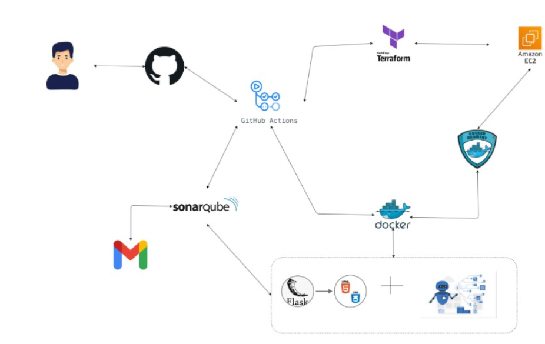

Architectural Overview
----------------------
This project implements an AI-driven medical assistance Telegram bot that processes brain scan images, detects anomalies using a YOLO model, and provides AI-generated explanations. The architecture consists of the following components:
----------------------
1. **Telegram Bot**: Built using the `python-telegram-bot` library, it handles user interactions, receives images, and sends responses.
2. **YOLO Object Detection**: A pre-trained YOLO model is used to analyze
brain scan images for anomalies. The model is loaded using PyTorch and processes incoming images to identify potential issues.
3. **AI Explanation**: The bot integrates with an AI model (e.g., Gemini
or similar) to generate explanations based on the detected anomalies. The AI model is called with a prompt that includes the analysis results and the original image.
4. **Context Management**: The bot maintains context for each user interaction, allowing for follow-up questions after the initial analysis. This is managed using `context.chat_data` in the Telegram bot framework.
5. **Error Handling and Logging**: The application includes robust error handling and logging to ensure
that issues are captured and can be debugged effectively. This includes logging for image processing, AI interactions, and user interactions.
----------------------
